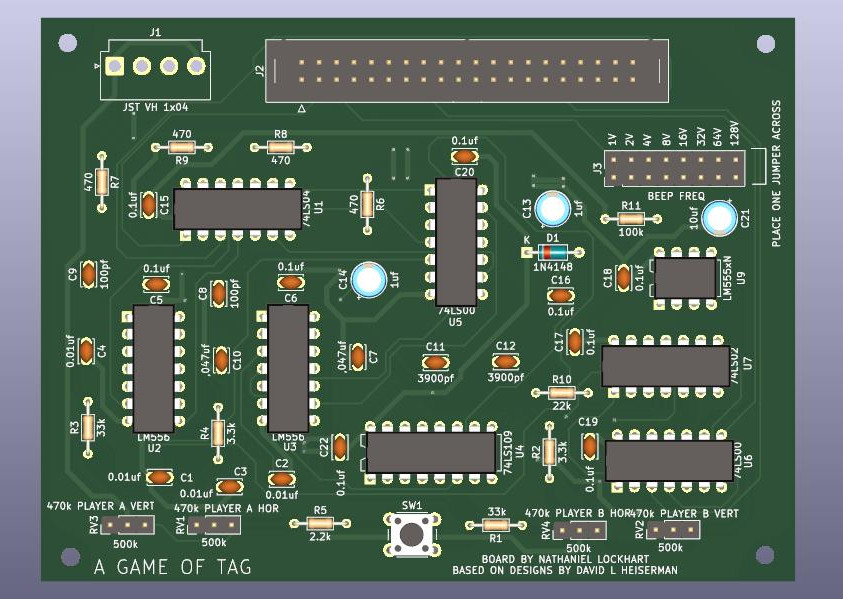

# A Game of Tag
Here's the first genuine game project from David L Heiserman's 1978 book "How to Design & Build Your Own Custom TV Games". It's a very simple game where two player squares are moved around the screen. When one square touches another, both players disappear from the screen (it's up to you to decide who is "it"). Originally even less complex, I opted to add a little beep sound for when the tag occurs. The pitch of the beep can be set with a jumper on the upper-right side of the board.

It's easy for the player charcaters to fly off the screen - I recommend marking on your potentiometer knobs a sort of "starting position". Anyways, I encourage you to take a look into the book and tweak the designs. There's one addition the book recommends that would add "inertia" to the moving squares! Have fun, and please don't hesitate to reach out with questions.

You can just solder wires directly from your player control pots to the PCB, or you can use pinheaders and have wires going from the pots with crimped on molex connectors at the other end. 

<b> BOM </b>

Caps: 
100pf x 2 
3900pf x 2 
10nf x 4 
47nf x 2 
0.1uf x 9 

Elec. Caps: 
1uf x 2 
10uf x 1 

Resistors: 
470ohm x 4 
2.2k x 1 
3.3k x 2 
22k x 1 
33k x 2 
100k x 1 

Potentiometers: 
500k x 4

Diode: 
1N4148 x 1

Switch: 
6x6mm tact switch x 1

Pin headers: 
2x20 IDC male, 2.54mm pitch 
2x8 pin header, 2.54mm pitch 
1x3 pin header, 2.54mm pitch x 4 

ICs: 
74LS00 x 2 
74LS02 
74LS04 
74LS109 
LM555 
LM556 x 2
